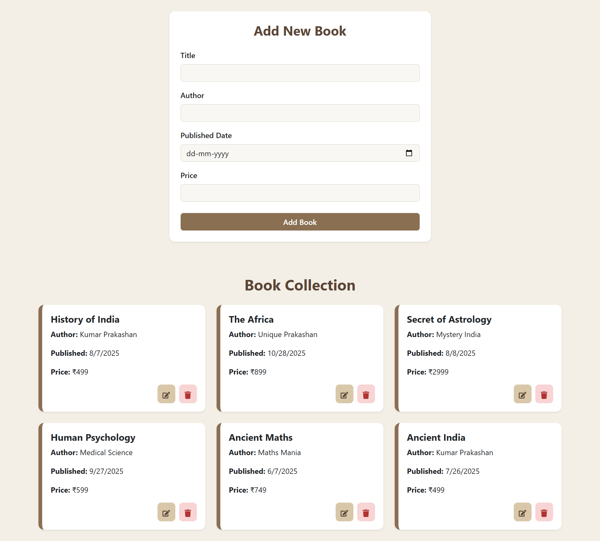

# 📚 Book Store Management
.
This project is a **Book Store Management System** built using the **MERN Stack** (MongoDB, Express.js, React, Node.js).  
It allows users to **add, view, update, and delete books** with details such as title, author, published date, and price  
The UI is clean, modern, and responsive, designed with Bootstrap and custom CSS.

---

## 🚀 Features  

* 📝 **Add, Update, and Delete Books** easily  
* 📚 **View Book Collection** in a card-based layout  
* 🎨 **Modern Responsive UI** — Light color theme with library-style design  
* ⚡ **MERN Stack Integration** — Backend API with Node.js and Express, MongoDB as database  
* 💻 **Single-Page Interaction** — Form and book list on the same page  

---

## 🛠️ Tech Stack  

    
  <b>React</b> — Frontend library for building interactive UI  
    

    
  <b>Node.js</b> — Backend runtime for server-side logic  
    

    
  <b>Express.js</b> — Backend framework for API routes  
    

    
  <b>MongoDB</b> — Database to store book details  
    

    
  <b>Bootstrap</b> — Responsive design and form styling  

---

## 📸 Project Preview  

---

## ⚙️ How It Works  

1. Open the application in the browser after running both **frontend** and **backend**.  
2. The **Add Book form** allows entering book details.  
3. Added books appear below in **card layout** with options to **edit** or **delete**.  
4. All data is stored in **MongoDB** via Express.js API.  
5. UI updates in real-time after each CRUD operation.  

---
